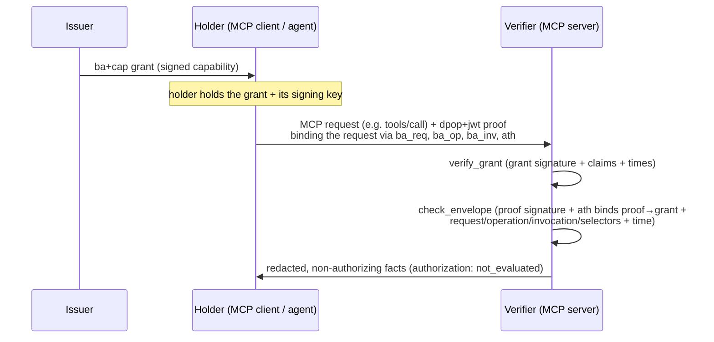

<Info>**Status**: draft — pre-submission; targeted at the MCP experimental-extension track
([SEP-2133](https://modelcontextprotocol.io/seps/2133-extensions) § Experimental Extensions). Not yet
submitted to, or accepted by, the MCP process. This is a project-tracked draft from the
[Bounded Authority Protocol](https://github.com/baselabs/bounded_authority_protocol).</Info>

The key words "MUST", "MUST NOT", "REQUIRED", "SHALL", "SHALL NOT", "SHOULD", "SHOULD NOT",
"RECOMMENDED", "NOT RECOMMENDED", "MAY", and "OPTIONAL" in this document are to be interpreted as
described in BCP 14 \[[RFC2119](https://datatracker.ietf.org/doc/html/rfc2119)]
\[[RFC8174](https://datatracker.ietf.org/doc/html/rfc8174)] when, and only when, they appear in all
capitals, as in the core specification. This extension uses the same conformance language as the
Model Context Protocol specification, as required by
[SEP-2133](https://modelcontextprotocol.io/seps/2133-extensions) § Official Extensions.

**Extension identifier:** `io.boundedauthority/capability-authorization`

## 1. Introduction

### 1.1 Purpose and scope

This extension defines an OPTIONAL, additive capability-authorization model for the Model Context
Protocol. An issuer grants a holder a cryptographically bounded capability over a set of MCP
operations and their arguments; the holder proves possession of that capability per invocation; a
verifier checks the capability against the invocation under a closed, fail-closed profile. The
capability binds *who may do what, against which arguments, until when* — finer-grained than the
OAuth-scope authorization the existing `ext-auth` extensions assume.

This extension is **additive** and **composable**: it does not replace OAuth-scope-based
authorization. A capability grant MAY narrow what OAuth scopes permit (capability-auth and scope-auth
compose; see § 5). The mechanism this extension documents is the already-normative
[Bounded Authority Protocol v1 profile](https://github.com/baselabs/bounded_authority_protocol/blob/main/docs/protocol-v1.md);
this document restates that mechanism in MCP vocabulary and introduces nothing normative outside it.

The Bounded Authority Protocol is a pure, deterministic verification library — **verification is not
authority** (§ 6). A successful verification proves only that caller-supplied bytes satisfy
caller-supplied trusted inputs; it never selects trusted keys, reserves replay, checks live
revocation, or grants execution. An MCP server's authorization decision remains its own.

### 1.2 Roles and terminology

- **Issuer** — the principal that signs a capability grant.
- **Holder** — the principal (e.g. an MCP client acting for an agent) to whom the grant's capability
  is issued, identified by a public-key thumbprint. The holder proves possession per invocation.
- **Verifier** — the MCP server (or its authorization layer) that checks the grant + holder proof
  against the expected invocation context.

## 2. Mechanism overview



Each step is normatively defined by the
[v1 profile](https://github.com/baselabs/bounded_authority_protocol/blob/main/docs/protocol-v1.md):
grant production and verification (§ Signing and digest inputs, § Public verification contract),
holder-proof production and binding (§ Claims — the `ath`/`ba_req`/`ba_op`/`ba_inv` rows), and the
conjunctive selector algebra over the invocation arguments (§ Selector algebra).

## 3. The grant, proof, and selector surfaces

Every value below is restated from the v1 profile; the v1 profile is the normative source and this
section cites it per claim. The claim, `typ`, selector-kind, and suite names (`ba+cap`, `dpop+jwt`,
`ba_inv`, `ba_op`, `ba_req`, `ath`, `cnf`, `BAP1-Ed25519-SHA256`, `all`/`equals`/`one_of`) are
defined in the [Bounded Authority Protocol registries](https://github.com/baselabs/bounded_authority_protocol/blob/main/docs/design/registries.md).
**Name registration status:** these names are currently unregistered; they are reserved under the
`ba_` / `ba+` collision-avoidance prefix and are to be filed with IANA (JWT Claims registry +
media-type suffix values) at first external submission, coordinated via the Bounded Authority
Protocol's BAP-12 roadmap row.

### 3.1 The `ba+cap` capability grant

A capability grant is a compact-JWS object ([RFC 7515](https://datatracker.ietf.org/doc/html/rfc7515))
with the protected header `{alg: "EdDSA", typ: "ba+cap", kid: key_identifier}` and the suite
`BAP1-Ed25519-SHA256` (EdDSA over Ed25519, SHA-256 digests; v1 profile § Protected headers). The
payload carries the closed claim set: `v` (exactly `1`), `iss`/`jti` (StringOrURI), `aud` (audience),
`iat`/`nbf`/`exp` (NumericDate times), `cnf: {jkt: <base64url sha256>}` (the holder's public-key
thumbprint), and `operations` (a nonempty array of `{name, selectors}` operation objects) — v1
profile § Claims (the Grant claim table). The holder is identified only by the `cnf.jkt` thumbprint;
the verifier recovers the holder key from the proof header (§ 3.2).

### 3.2 The `dpop+jwt` holder proof

A holder proves possession per invocation with a compact-JWS proof of `typ: dpop+jwt` (header
`{alg: "EdDSA", typ: "dpop+jwt", jwk: <public OKP JWK>}`, per [RFC 9449](https://datatracker.ietf.org/doc/html/rfc9449)
as profiled by v1). The proof payload's invocation-binding claims are: `htm`/`htu` (the MCP HTTP
method + normalized target URI), `ba_inv` (a lowercase RFC 4122 UUID identifying the invocation),
`ba_op` (the operation name, matching a grant operation's `name`), `ba_req` (a SHA-256 request
digest over `[operation, typed(cast_arguments)]` under the `BAP1-REQUEST\0` domain), and `ath`
(SHA-256 over the grant's compact bytes, binding proof → grant exactly as RFC 9449 binds a DPoP proof
to its access token). The complete required proof claim set also includes `v` (exactly `1`), `jti`,
`iat`, and the optional `nonce` (a server-issued replay-binding challenge) — see v1 profile § Claims
(the Proof claim table + the `ath` row). The verifier checks the proof signature, that `ath`
re-derives from the presented grant, and that the proof's `ba_op`/`ba_req`/`ba_inv` match the
invocation; nonce-mode replay binding is the server's responsibility (the verifier is pure and
stateless — see § 6).

### 3.3 The conjunctive selector algebra

Each grant operation carries a `selectors` array over three closed kinds — `all` (matches any
argument root), `equals` (an object path must carry a given value), `one_of` (a path must carry any
of a list of values) — v1 profile § Selector algebra + the registries selector-kind rows. Matching
is a conjunction: a request's cast-arguments satisfy an operation iff EVERY selector in its array
matches. This is the load-bearing fact for the capability model: a grant narrows what an operation
accepts, and a delegation (a future contract-major) can only narrow further (add conjuncts). The
verifier checks the invocation's arguments against the matched operation's selectors under the same
closed rules.

## 4. Capability negotiation

Per [SEP-2133](https://modelcontextprotocol.io/seps/2133-extensions) § Negotiation, clients and
servers advertise support for this extension in the `initialize` request/response:

```json
{
  "capabilities": {
    "extensions": {
      "io.boundedauthority/capability-authorization": {
        "suite": "BAP1-Ed25519-SHA256",
        "contract_major": 1
      }
    }
  }
}
```

The settings object identifies the deployment's accepted cryptographic suite and contract-major (the
Bounded Authority Protocol's reserved "verifier discovery document" shape; registries § reserved
names). An empty object indicates no settings.

### 4.1 Graceful degradation

If one party supports this extension but the other does not, the supporting party MUST revert to
core MCP authorization behavior (OAuth-scope-based authorization, per the existing `ext-auth`
extensions). A server that REQUIRES capability-authorization for a specific tool/resource MAY reject
connections from clients that do not support the extension, as [SEP-2133](https://modelcontextprotocol.io/seps/2133-extensions)
§ Graceful Degradation permits for mandatory extensions. The default fallback is reverting to core
behavior, preserving composability with scope-based authorization.

## 5. Relationship to OAuth-scope authorization

The existing `ext-auth` extensions authorize via OAuth scopes delegated to the authorization server.
This extension is **composable, not equivalent**: a `ba+cap` capability grant is finer-grained than a
scope (it binds specific operations + argument-shapes + times + audiences), and capability-auth
MAY narrow what scope-auth permits. A deployment that uses both treats the capability as an
additional bound the invocation must satisfy; the capability does not widen scope-permitted access.
This extension does not define how an MCP deployment obtains or maps OAuth scopes to capabilities —
that is the deployment's authorization-server concern.

## 6. Security considerations

[SEP-2133](https://modelcontextprotocol.io/seps/2133-extensions) § Security Implications requires
extensions to "implement all related security best practices in the area that they extend." This
extension's security posture is the Bounded Authority Protocol's, restated:

- **Verification is not authority.** A verified grant + proof proves only that the bytes satisfy the
  caller-supplied trusted key, expected audience, and invocation context. It does NOT select trusted
  keys, reserve replay, check live revocation, or authorize an effect. The MCP server's
  authorization decision — including replay reservation, revocation state, and the actual effect — is
  the server's own responsibility (v1 profile § Public verification contract; the Bounded Authority
  Protocol threat model).
- **Closed, fail-closed profile.** Unknown algorithms, headers, claims, selector kinds, duplicate
  members, invalid encodings, and over-limit structures return closed, value-free errors. The closed
  `ba+cap` / `dpop+jwt` `typ` set, the closed claim sets, and the closed selector kinds structurally
  reject the `alg:"none"`, `crit`-confusion, and permissive-compatibility classes that degraded prior
  token formats (v1 profile § Protected headers, § Claims, § Selector algebra).
- **Holder binding.** The proof's `jwk` header key is bound to the grant's `cnf.jkt` thumbprint
  (RFC 7638); a proof from any other key fails. `ath` binds the proof to the exact grant bytes; a
  proof replayed against a different grant fails.
- **Request binding.** `ba_req` (the request digest), `ba_op` (the operation), and `ba_inv` (the
  invocation UUID) bind the proof to the specific invocation; a proof replayed against a different
  request, operation, or invocation fails. Replay reservation across invocations is the server's
  responsibility (the verifier is pure and stateless).

Clients and servers SHOULD treat all extension-introduced fields as untrusted and validate them
comprehensively, as [SEP-2133](https://modelcontextprotocol.io/seps/2133-extensions) § Security
Implications recommends.
